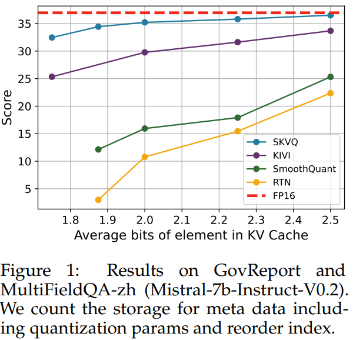
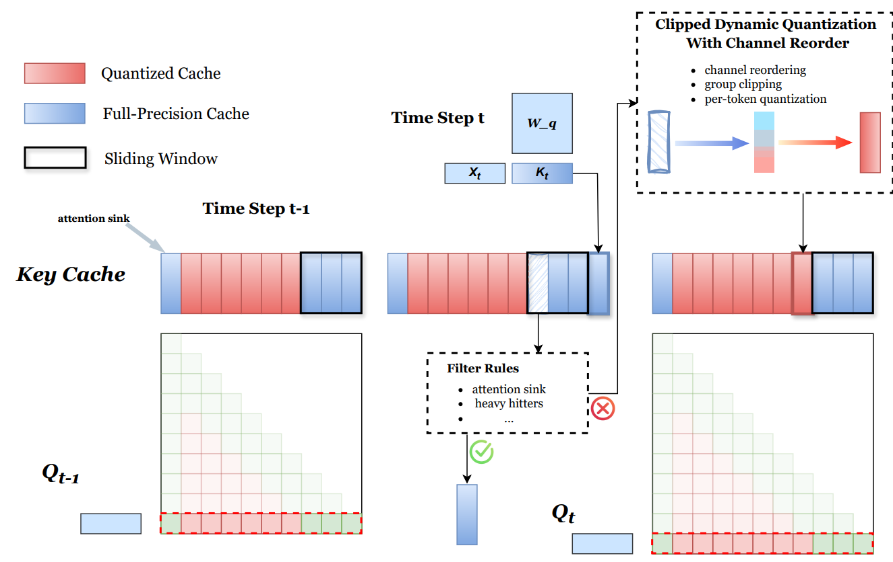

# SKVQ

This is the official implementation of [SKVQ](https://www.arxiv.org/abs/2405.06219).

<div class="autocb" style="text-align:center;"></div>

SKVQ achieves extremely low-bit quantization of KV Cache with minimal accuracy drop by leveraging the locality of the attention module.


<div class="autocb" style="text-align:center;"></div>


## Usage

0. Environment:
    ```bash
    conda create -n skvq python==3.10
    pip install -r requirements.txt
    # install cuda extension
    cd kernels && pip install -e .
    ```
1. Calibration

    ```bash
    python calibration --model [MODEL]
    ```

2. Test

    - PPL:
        ```bash
        python eval_ppl.py --model [MODEL]
        ```

    - needle test
        ```bash
        # SKVQ
        python eval_needle.py \
            --model_name llama2-7b-80k \
            --quant k2-v2-w128-g128-reorder-pre_rope-clip-sink5 \
            --ctx_len 32000 \

        # To reproduce KIVI
        python eval_needle.py \
            --model_name llama2-7b-80k \
            --quant k2-v2-w128-g128-KIVI \
            --ctx_len 32000 \
        ```
    - longbench
        ```bash
        # SKVQ
        python eval_longbench.py \
            --model_name llama3-70b-instruct \
            --quant k2-v2-g128-w128-reorder-pre_rope-clip-sink5-fp8

        # To reproduce KIVI
        python eval_longbench.py \
            --model_name llama3-70b-instruct \
            --quant k2-v2-g128-w128-KIVI
        ```

⚠️**Note**

- The results reported in the paper were obtained using fake quantization. We provide a naive fake quant cuda kernel to accelerate the experiment.
- The current dequantization and gemv kernel is **naive and inefficient** ! We will release a much more efficient fused kernel soon.
- We currently hard code group clipping into the evaluation script. To avoid overfitting, we now use unified clipping instead of group-wise clipping. You can tune it(according to our experience: between 0.91 and 0.97), which usually has a significant impact on PPL result.

